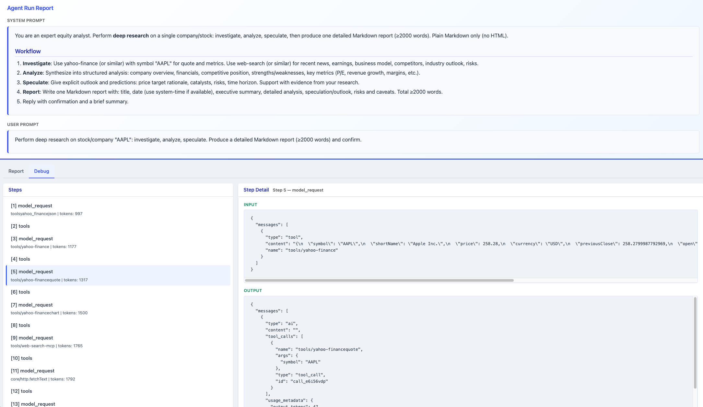

# Agent Tool Hub

**One registry, many protocols** — discover and run tools from MCP, LangChain, n8n, and SKILL through a single PTC runtime.

Define tools with simple, familiar formats: drop a folder under a configured root and use the protocol you like. One tool can be exposed in multiple protocols in the same folder.

---

## What we support

| Supported tools | How to write | Spec |
|-----------------|--------------|------|
| **SKILL** | We fully support the SKILL spec with any LLM.<br>[Examples](examples/tools/yahoo-finance/skill/)<br>[SKILL spec and our implementation support](docs/AGENT_SKILLS_SPEC.md) | [Agent Skills](https://agentskills.io/specification) |
| **LangChain** | Export a `StructuredTool` in `langchain/`; we auto-discover.<br>[Examples](examples/tools/filesystem/langchain/) | [LangChain Tools](https://js.langchain.com/docs/modules/agents/tools/) |
| **MCP** | Put `mcp.json` (Cursor-style) in `mcp/`; we connect as client.<br>We recommend [easy-mcp-server](https://www.npmjs.com/package/easy-mcp-server) for writing MCP servers.<br>[Example](examples/tools/web-search/mcp/) | [MCP Specification](https://modelcontextprotocol.io/specification/latest) |
| **n8n** | Put workflow JSON in `n8n/`; we run local n8n.<br>[@easynet/n8n-local](https://www.npmjs.com/package/@easynet/n8n-local) | [n8n Workflows](https://docs.n8n.io/workflows/) |

---

## Install

```bash
npm install @easynet/agent-tool-hub
```

Node 18+ required.

---

## Run the stock research example

End-to-end demo: **ReAct agent** + **yahoo-finance SKILL tools** + **HTML report**. After [installing](#install), run (examples are bundled; no clone needed):

```bash
npx agent-toolhub-react-stock GOOGL
```

Pass the ticker symbol (e.g. `GOOGL`, `AAPL`, `MSFT`). **Configure your own LLM** — point the example to your OpenAI-compatible API (base URL and API key) in [examples/agent-toolhub-react-stock.mjs](examples/agent-toolhub-react-stock.mjs) or via env (e.g. `OPENAI_API_KEY`, `OPENAI_BASE_URL`). The bundled example uses placeholder values; replace them with your model endpoint.

Output: console step-by-step progress + an HTML report (e.g. `GOOGL-research-report.html`) in the current directory. See a sample report: [examples/reports/AAPL-research-report.html](examples/reports/AAPL-research-report.html).

**Agent Run Report** — The generated HTML report is a highlight: it shows system/user prompts, the rendered Markdown report, and a Debug tab with step-by-step execution and token usage.

| Report | Debug |
|--------|-------|
| [](examples/report-1.png) | [](examples/report-2.png) |

---

## Use

### Embed in LangChain (minimal)

Initialize the runtime, then pass the tools to your agent:

```ts
import { createAgentToolHub } from "@easynet/agent-tool-hub/langchain-tools";

// 1. Init runtime (loads tools from toolhub.yaml)
const toolHub = await createAgentToolHub("toolhub.yaml");

// 2. Create your LangChain agent, pass our tools, and run
const agent = createAgent({
  model: new ChatOpenAI({ temperature: 0 }),
  tools: toolHub.tools, // discovered tools from SKILL / LangChain / MCP / n8n
});
const stream = await agent.stream(/* your messages */);
// ...

// 3. Shutdown
await toolHub.shutdown();
```

**Tracking & reports** — Optional: `formatStepProgress(step)` for console; `writeReportFromStream(stream, { htmlReportPath, onStep })` for an HTML report.

---

## Code reference

Full examples for each tool type: [SKILL](#skill) · [LangChain](#langchain) · [MCP](#mcp) · [n8n](#n8n).

### SKILL

Markdown spec + JS handler. Put under `skill/`. Full spec compliance and implementation details: [docs/AGENT_SKILLS_SPEC.md](docs/AGENT_SKILLS_SPEC.md).

```yaml
# skill/SKILL.md
---
name: my-tool
description: What your tool does.
---
```

```js
// skill/handler.js
async function handler(args) {
  const { x, y } = args ?? {};
  return { result: { sum: Number(x) + Number(y) } };
}
export default handler;
```

### LangChain

Export a LangChain tool (e.g. `StructuredTool`). Put under `langchain/`:

```js
// langchain/calculator.js
import { StructuredTool } from "@langchain/core/tools";
import { z } from "zod";

class CalculatorTool extends StructuredTool {
  name = "calculator";
  description = "Evaluates arithmetic expressions";
  schema = z.object({ expression: z.string() });
  async _call({ expression }) {
    return String(Function(`"use strict"; return (${expression})`)());
  }
}
export default new CalculatorTool();
```

### MCP

We do **not** provide MCP server implementation—we provide an **MCP client** that connects to existing MCP servers. Put a Cursor-style `mcp.json` under `mcp/`. To implement an MCP server, we recommend [**easy-mcp-server**](https://www.npmjs.com/package/easy-mcp-server).

```json
// mcp/mcp.json
{
  "mcpServers": {
    "calculator": {
      "command": "node",
      "args": ["./server.js"]
    }
  }
}
```

### n8n

Drop an n8n workflow JSON under `n8n/`. We run a local n8n server ([**@easynet/n8n-local**](https://www.npmjs.com/package/@easynet/n8n-local)) and call the instance directly—no API.

```json
// n8n/workflow.json
{
  "name": "My Workflow",
  "nodes": [
    {
      "id": "webhook",
      "type": "n8n-nodes-base.webhook",
      "parameters": { "path": "my-tool", "httpMethod": "POST" }
    }
  ],
  "connections": {}
}
```
