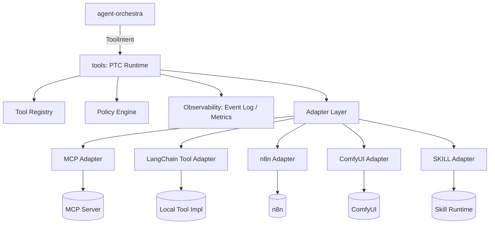

# 多协议 Tools Package 设计文档（MCP / LangChain Tool / n8n / ComfyUI / SKILL + PTC Runtime）

> 面向：Node.js / TypeScript 工程师  
> 目标：实现一个可复用的 `tools` 包，统一管理多种“工具/工作流/技能”的发现、注册、调用与治理（PTC）。  
> 版本：v1.0  
> 日期：2026-01-23 (America/Los_Angeles)

---

## 1. 背景与目标

你计划开发两个 npm package：

- **agent-orchestra**：负责任务树、计划、路由、验收、重试等“编排”
- **tools**：负责各种工具的“定义、调用、治理、审计”（**PTC Runtime** 在这里）

你希望 `tools` 包同时支持多种工具形态：

- **MCP**（工具发现 + 远程调用）
- **LangChain Tool**（本地/远程 Tool）
- **n8n workflow**（业务工作流触发）
- **ComfyUI workflow**（图像工作流，通常异步）
- **Anthropic 风格 SKILL**（更高层的技能/子流程）

核心原则：把这些都统一成同一套可声明、可校验、可执行、可审计的工具抽象。

---

## 2. 总体架构

### 2.1 架构图



### 2.2 分层职责

**tools 包内：**

1. **统一工具抽象（ToolSpec）**
2. **工具注册中心（Registry）**：静态注册 + 动态发现 + 缓存
3. **PTC Runtime（执行内核）**：校验/默认值/权限/预算/重试/幂等/审计
4. **适配器层（Adapters）**：把 MCP/n8n/ComfyUI 等统一为同一调用接口
5. **异步任务管理（Async Job Manager）**：统一处理 jobId/poll/result
6. **可观测性（Event Log + Metrics + Trace）**

**agent-orchestra 包内：**

- 决定“什么时候调用什么工具”
- 只生成 `ToolIntent`，不直接触达外部系统

---

## 3. 关键设计原则（稳定性来源）

1. **任何工具调用都必须走 PTC Runtime**（禁止绕过）
2. **输入/输出都结构化**：JSON Schema 校验（AJV），不合格拒绝执行
3. **副作用治理**：capability/permission gate、allowlist、危险操作拦截
4. **预算与熔断**：timeout/retry/backoff、rate limit、circuit breaker
5. **幂等性**：idempotencyKey 防止重复触发（尤其 n8n/写操作）
6. **证据（evidence）与审计**：可追溯工具调用与结果摘要
7. **异步统一**：submit + poll + getResult 模式

---

## 4. 统一抽象：ToolSpec / Invocation / Result

### 4.1 ToolSpec（工具声明）

```ts
export type ToolKind = "mcp" | "langchain" | "n8n" | "comfyui" | "skill";

export type Capability =
  | "read:web" | "read:fs" | "write:fs"
  | "read:db" | "write:db"
  | "network" | "gpu" | "workflow"
  | "danger:destructive";

export interface ToolSpec {
  name: string;                 // 全局唯一：建议 namespace/name
  version: string;              // semver
  kind: ToolKind;

  description?: string;
  tags?: string[];

  inputSchema: object;          // JSON Schema
  outputSchema: object;         // JSON Schema

  capabilities: Capability[];
  costHints?: { latencyMsP50?: number; latencyMsP95?: number; isAsync?: boolean };

  // adapter-specific metadata
  endpoint?: string;            // MCP/n8n/ComfyUI 等
  resourceId?: string;          // workflowId / promptId / etc
  impl?: any;                   // LangChain Tool / 本地函数引用（仅 langchain kind）
}
```

### 4.2 Invocation（调用请求：来自 agent-orchestra 的意图）

```ts
export interface ExecContext {
  requestId: string;
  taskId: string;

  permissions: Capability[];     // 当前调用允许的能力集合
  budget?: { timeoutMs?: number; maxRetries?: number; maxToolCalls?: number };

  // observability
  traceId?: string;
  userId?: string;
}

export interface ToolIntent {
  tool: string;                 // ToolSpec.name
  args: unknown;                // 不可信输入
  purpose: string;              // 审计用：为什么调用
  idempotencyKey?: string;      // 强烈建议由代码生成：requestId+taskId+tool
}
```

### 4.3 Result（调用结果：返回给 agent-orchestra）

```ts
export interface Evidence {
  type: "tool" | "file" | "url" | "text" | "metric";
  ref: string;
  summary: string;
  createdAt: string;            // ISO
}

export interface ToolResult {
  ok: boolean;
  result?: any;                 // 必须满足 outputSchema
  evidence: Evidence[];

  error?: { kind?: string; message: string; details?: any };
  raw?: any;                    // 可选：用于 debug（生产可关闭）
}
```

---

## 5. PTC Runtime：统一执行链

### 5.1 执行步骤（强制顺序）

1. **Resolve**：从 Registry 获取 ToolSpec  
2. **Input Validate**：AJV 校验 args  
3. **Defaults Enrich**：补默认值（代码补，不让 LLM 补）  
4. **Policy Gate**：权限/能力/副作用/allowlist/denylist  
5. **Budget**：timeout、maxRetries、rate limit、并发限制  
6. **Execute**：根据 kind 选择 adapter.invoke()  
7. **Output Validate**：AJV 校验输出  
8. **Evidence Build**：记录 toolCallId、链接、关键摘要  
9. **Audit & Metrics**：事件日志、指标、trace span

### 5.2 伪代码

```ts
async function invoke(intent: ToolIntent, ctx: ExecContext): Promise<ToolResult> {
  const spec = registry.get(intent.tool);
  if (!spec) return fail("TOOL_NOT_FOUND");

  // 1) schema validate input
  const args = validateAndCoerce(spec.inputSchema, intent.args);

  // 2) defaults + policy
  const enriched = applyDefaults(spec, args);
  enforcePolicy(spec, enriched, ctx);

  // 3) execution
  const adapter = adapters.get(spec.kind);
  const { result, raw } = await withBudgetAndRetry(() => adapter.invoke(spec, enriched, ctx), ctx);

  // 4) schema validate output
  const final = validateOutput(spec.outputSchema, result);

  // 5) evidence + audit
  const evidence = buildEvidence(spec, enriched, final, raw, ctx);
  auditLog.append({ type: "TOOL_RESULT", ... });

  return { ok: true, result: final, evidence };
}
```

---

## 6. Tool Registry：静态注册 + 动态发现

### 6.1 Registry 能力

- `register(spec: ToolSpec)`
- `bulkRegister(specs: ToolSpec[])`
- `get(name: string): ToolSpec | undefined`
- `search(query, capabilityFilter, tagFilter)`
- `refresh()`：从 MCP/LangChain discovery 拉取并更新（可缓存 30s~5min）
- `snapshot()`：导出当前工具列表（用于路由/调试）

### 6.2 动态发现策略

- **MCP**：启动时拉取工具列表；定时刷新（带 ETag/版本）
- **LangChain**：扫描本地注册表（或由应用注入）
- **n8n/ComfyUI**：一般更偏静态（workflow 模板固定），也可提供“发现 API”作为增强项

---

## 7. Adapters 设计

统一接口：

```ts
export interface ToolAdapter {
  kind: ToolKind;
  listTools?(): Promise<ToolSpec[]>;  // 可选：支持 discovery
  invoke(spec: ToolSpec, args: any, ctx: ExecContext): Promise<{ result: any; raw?: any }>;
}
```

### 7.1 MCP Adapter

- `listTools()`：从 MCP server 获取工具列表，映射为 ToolSpec
- `invoke()`：调用 MCP tool

**工程要点：**
- 连接池、超时、重试、断路器
- schema 映射（MCP schema → internal schema）
- 鉴权（token/mtls）

### 7.2 LangChain Tool Adapter

- spec.impl 保存 LangChain Tool 实例或函数包装
- `invoke()` 调用 `tool.invoke(args)`（或兼容不同版本）

**工程要点：**
- 统一错误与超时
- 对副作用工具加 capability gate

### 7.3 n8n Adapter

两种调用模式：

1) **Webhook Trigger（推荐）**：每个 workflow 暴露 webhook url  
2) **n8n API**：通过 API 启动 workflow（需权限管理）

**同步 vs 异步：**
- workflow 快：同步返回结果
- workflow 慢：返回 `{ jobId }`，由 Async Job Manager 继续轮询

**幂等：**
- idempotencyKey 作为 workflow 输入字段
- 或在 n8n 中实现去重节点

### 7.4 ComfyUI Adapter

建议将每个 ComfyUI 工作流模板注册为一个 tool：

- `invoke()`：提交 queue，返回 `{ jobId }`
- `getStatus(jobId)` / `getResult(jobId)`：查询并获取生成产物

**证据：**
- workflow hash、seed、输出文件路径/URL、生成参数摘要

### 7.5 SKILL Adapter

把 “SKILL” 当成“一个可调用的子流程/能力”：

- 输入输出同样 schema 化
- 可内部执行：prompt chain、另一个 agent、小型 workflow

**强约束：**
- SKILL 必须返回结构化结果 + evidence
- 不允许 SKILL 自己 finalize 全局

---

## 8. 异步任务统一（Async Job Manager）

很多工具天然异步（ComfyUI、部分 n8n、长耗时 MCP）：

### 8.1 统一协议

- `invoke()` 若是 async，返回：
  - `{ jobId, status: "queued"|"running" }`

配套工具（可作为工具或内部方法）：

- `jobs.getStatus(jobId)`
- `jobs.getResult(jobId)`

### 8.2 Job 存储

- 内存（PoC）→ Redis（生产推荐）→ DB（可选）
- job 记录：
  - `jobId, toolName, requestId, taskId, createdAt, lastStatus, resultRef`

---

## 9. Policy Engine（权限与副作用治理）

### 9.1 Capability Gate

- ctx.permissions 必须覆盖 spec.capabilities 的子集（或至少覆盖“危险能力”）
- `danger:destructive` 默认拒绝，除非显式授权

### 9.2 参数级安全校验

- 文件路径必须在 sandbox
- URL allowlist（可选）
- SQL 禁止 drop/truncate（或需审批）
- 网络调用限制域名/端口

### 9.3 二阶段提交（可选）

对高风险工具：
- `dryRun: true` 先返回拟执行内容
- agent-orchestra 决定是否 commit

---

## 10. 可观测性（Event Log / Metrics / Trace）

### 10.1 事件日志（append-only）

记录：

- TOOL_CALLED：toolName、args 摘要（脱敏）
- TOOL_RESULT：ok/err、duration、result 摘要
- POLICY_DENIED：原因
- RETRY：次数与原因

### 10.2 指标

- `tool_invocations_total{toolName,ok}`
- `tool_latency_ms_bucket{toolName}`
- `tool_retries_total{toolName}`
- `policy_denied_total{toolName,reason}`

---

## 11. 错误模型与返回规范

### 11.1 错误分类（kind）

- `TOOL_NOT_FOUND`
- `INPUT_SCHEMA_INVALID`
- `POLICY_DENIED`
- `BUDGET_EXCEEDED`
- `TIMEOUT`
- `UPSTREAM_ERROR`（MCP/n8n/ComfyUI）
- `OUTPUT_SCHEMA_INVALID`

### 11.2 对 agent-orchestra 的返回要求

- 永远返回 `ToolResult`（不抛裸异常）
- error.details 包含可修复信息（缺字段、范围、allowlist 告知）

---

## 12. 目录结构（建议）

```
./
  src/
    core/
      PTCRuntime.ts
      PolicyEngine.ts
      SchemaValidator.ts
      Evidence.ts
      Budget.ts
      Retry.ts
    registry/
      ToolRegistry.ts
      Discovery.ts
    adapters/
      MCPAdapter.ts
      LangChainAdapter.ts
      N8nAdapter.ts
      ComfyUIAdapter.ts
      SkillAdapter.ts
    jobs/
      AsyncJobManager.ts
    types/
      ToolSpec.ts
      ToolIntent.ts
      ToolResult.ts
      Events.ts
    observability/
      EventLog.ts
      Metrics.ts
      Tracing.ts
  README.md
  package.json
```

---

## 13. 最小可行实现（MVP）路线

1. **v0：核心 PTC Runtime + Registry + LangChainAdapter**
2. **v1：MCPAdapter（支持 discovery）**
3. **v2：n8nAdapter + 幂等 + async job**
4. **v3：ComfyUIAdapter + 产物管理**
5. **v4：SkillAdapter + 更严格 schema/验收**

---

## 14. 与 agent-orchestra 的集成契约

agent-orchestra 只允许调用：

- `tools.invoke(intent, ctx)`
- `tools.searchTools(query, filters)`
- `tools.getToolSchema(toolName)`

禁止：
- agent-orchestra 直接发 HTTP/写文件（必须经 tools）

---

## 15. 示例：注册一个 n8n workflow tool

```ts
registry.register({
  name: "workflow/send_slack_message",
  version: "1.0.0",
  kind: "n8n",
  description: "发送 Slack 消息（n8n 工作流）",
  inputSchema: {
    type: "object",
    properties: { channel: {type:"string"}, text: {type:"string"} },
    required: ["channel","text"],
    additionalProperties: false
  },
  outputSchema: {
    type: "object",
    properties: { ok: {type:"boolean"}, ts: {type:"string"} },
    required: ["ok"],
    additionalProperties: true
  },
  capabilities: ["workflow", "network"],
  endpoint: "https://n8n.example.com/webhook/xxx",
  resourceId: "slack_send_message"
});
```

调用：

```ts
await tools.invoke({
  tool: "workflow/send_slack_message",
  args: { channel: "#alerts", text: "Hello" },
  purpose: "Notify deployment result",
  idempotencyKey: `${ctx.requestId}:${ctx.taskId}:slack`
}, ctx);
```

---

# 结尾简要总结

本设计将 MCP / LangChain Tool / n8n / ComfyUI / SKILL 统一为 `ToolSpec + Adapter` 模型，并用 `PTC Runtime` 提供稳定性与安全治理：输入输出 schema 校验、默认值补全、权限/副作用 gate、预算与重试、幂等与审计、异步 job 统一。`agent-orchestra` 只负责“何时调用/为何调用”，`tools` 包保证“怎么稳定、安全地调用”，从而形成可复用、可扩展、生产可用的工具平台。
